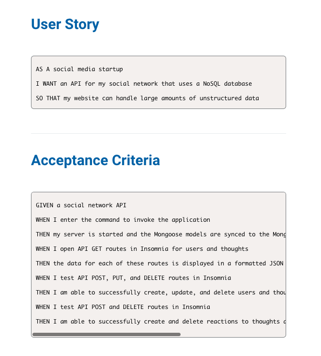
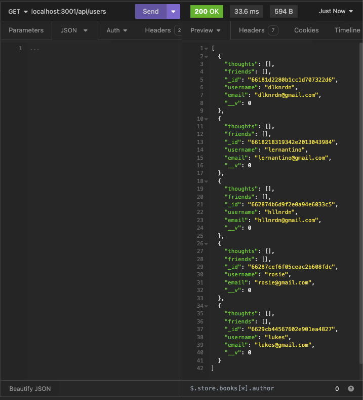

# NoSQL-Social-Networking

## Description 

NoSQL Social Networking is a Node.js application programming interface (API) that allows users to perform CRUD operations on social networking data models using a NoSQL database. The data models include friends, users, thoughts, and reaction data models, and they can be retrieved by ID or all of them. This API is built using Node.js and Mongoose, and it provides a simple and scalable way to handle social networking data without the restrictions of traditional relational databases.

## Summary

 

 

 

The challenge was to build a RESTful API that allows a social media startup to perform CRUD operations on users, thoughts, and reactions data models using a NoSQL database. The API must be built using Node.js and Mongoose and must provide endpoints that can handle large amounts of unstructured data.

API must allow users to:

Create and delete user accounts.
Create, read, update, and delete thoughts.
Add and remove reactions to thoughts.

## Installation / Usage 

In order to install you need to Clone this repository to your local machine so you can use the application. 

Step 1 --> Clone Repository

Step 2 --> Run npm install in your terminal.

Step 3 --> You will need to create your own .env file with your inputs to connect to the DB. 

Step 4 --> Run Node Index.js to connect to the local port/server. (https://localhost:3001)

Step 5 --> Open Insomnia and make API GET, POST, PUT and DELETE requests. You have to update the necessary data to get the parameters as specified in the acceptance criteria. 

## License 

MIT License

## Walkthhrough Video

https://drive.google.com/file/d/1cE9Is57-0D5pUl59djD_GCEOmoLhFoL9/view 

## Author 

Dilek Nuredin 

https://github.com/dileknrdn